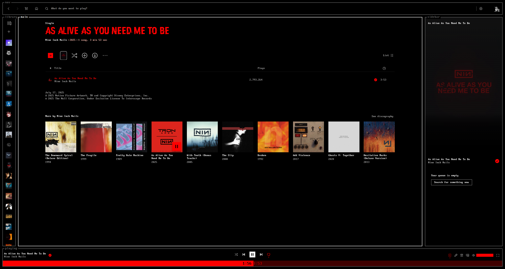

## Ares



### Description

A Spicetify theme that mimics the look of [spotify-tui](https://github.com/Rigellute/spotify-tui) and Tron: Ares. Meant to be used on 90% scaling.

### Credits

created by [darkthemer](https://github.com/darkthemer/) and modified by [FantomTchi7](https://github.com/FantomTchi7/).

### Notes

-   **SUGGESTION:** For Windows users, here's how to make the window controls' background match with the topbar background.

    -   Enable [CEF/Spotify Tweaks](https://windhawk.net/mods/cef-titlebar-enabler-universal) in Windhawk (recommended).

    -   Alternatively, Put this snippet into your `user.css` (or through the Marketplace's `+ Add CSS` feature).

```css
/* transparent window controls background */
.spotify__container--is-desktop:not(.fullscreen) body::after {
    content: "";
    position: absolute;
    right: 0;
    z-index: 999;
    
    backdrop-filter: brightness(2.12);
    /* page zoom [ctrl][+] or [ctrl][-]
       edit width and height accordingly */
    width: 135px;
    /* depending on what global status bar
       style is enabled height need to be
       changed accordingly. */
    height: 32px;
    margin-top: 16px;
}
```


